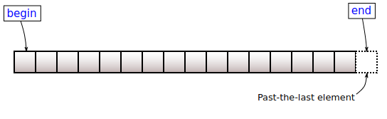

# std::begin, std::end, std::next, std::prev

Bu serbest fonksiyonlar standard containerların içinde iteratörler kullanarak gezmeye yarar.

#### std::begin

Standard containerların ilk elementinin iteratörünü ya da c-style arraylerin ilk elemanına referans olan bir pointer döner.

#### std::end

Standard conatinerların son elementinden sonraki iteratörünü ya da c-style arraylerin son elemanından bir sonraki pointerı döner.

#### std::next

    std::next(iterator, n);

şeklinde kullanılır ve bir iteratörden n sonraki iteratörü döner. n için bir sayı verilmezse, default argüman olarak 1'i kullanarak bir sonraki iteratörü döner.

#### std::prev

    std::prev(iterator, n);
    
şeklinde kullanılır ve bir iteratörden n önceki iteratörü döner. n için bir sayı verilmezse, default argüman olarak 1'i kullanarak bir önceki iteratörü döner.
